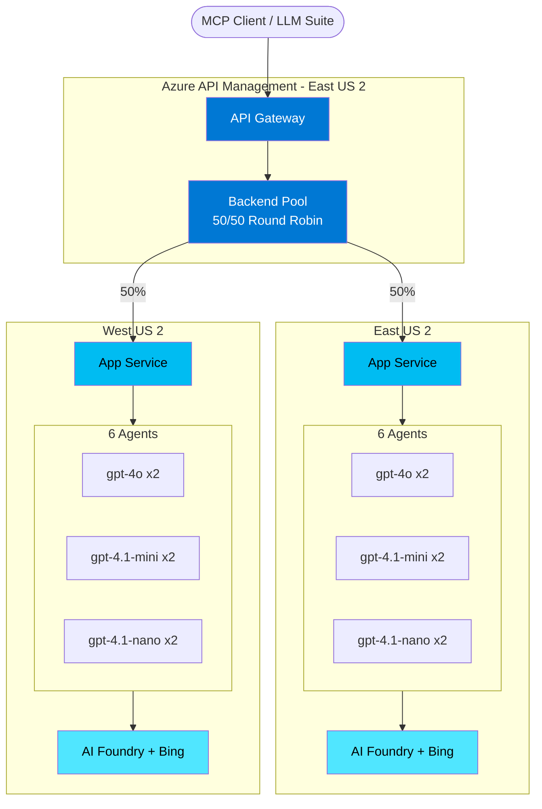
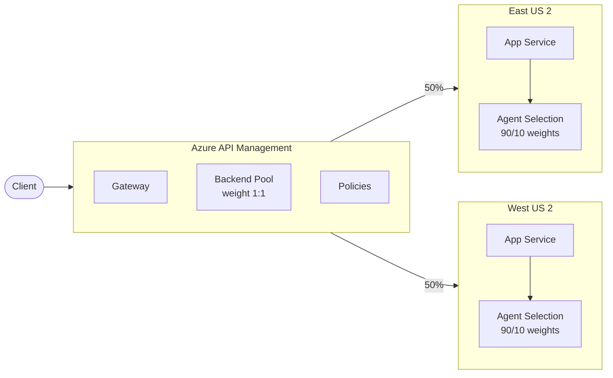
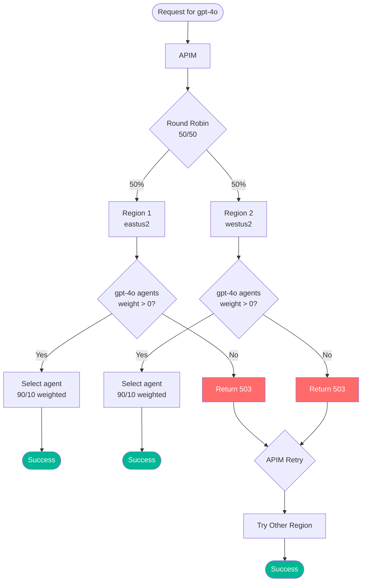
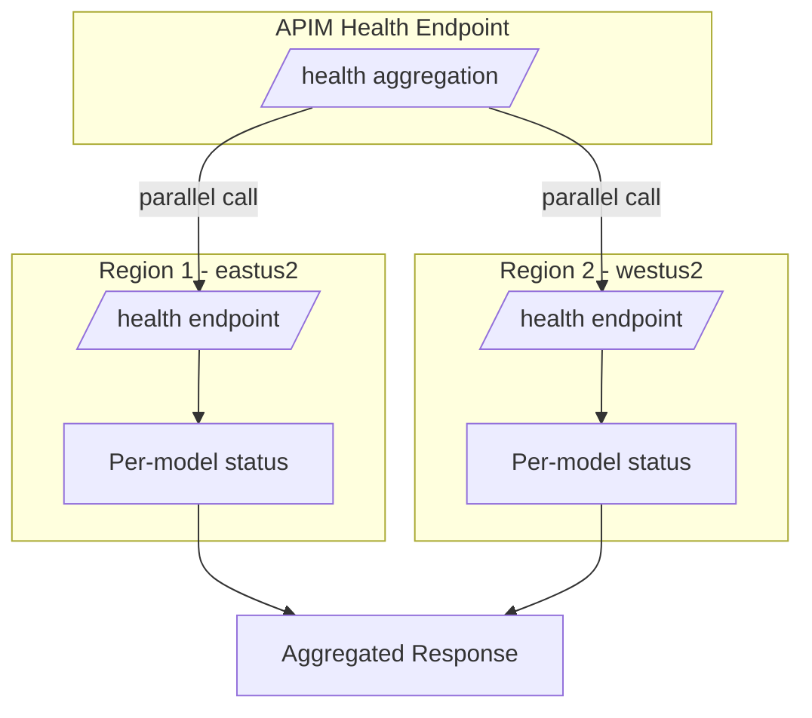
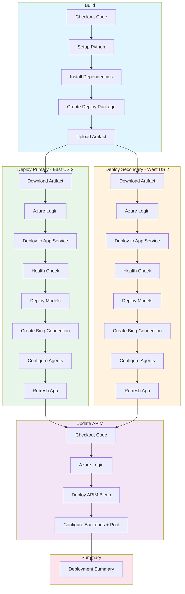
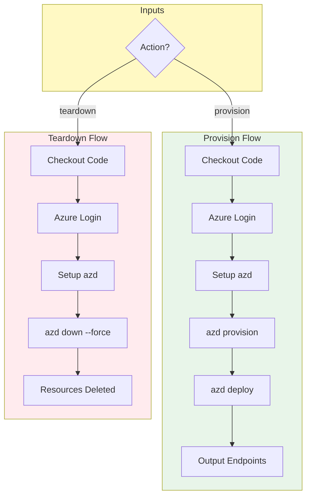
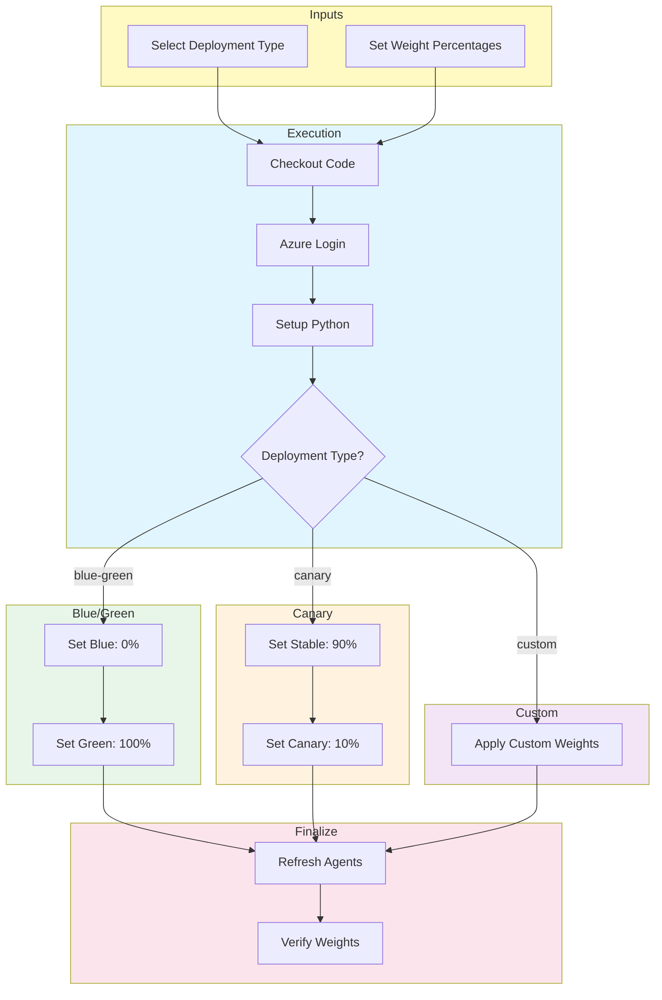

# Bing Grounding API

A FastAPI-based REST API and Model Context Protocol (MCP) server for Azure AI Agent Service with Bing grounding capabilities. Provides grounded AI responses with automatic citation extraction through both REST and MCP interfaces.

## Features

✅ **REST API** wrapper for Azure AI Agent with Bing grounding  
✅ **Model Context Protocol (MCP) server** via Azure API Management  
✅ Structured JSON responses with citations  
✅ Region tracking metadata for multi-region deployments  
✅ Azure App Service deployment  
✅ Health check endpoint  
✅ Thread management and cleanup  
✅ **APIM load balancing with circuit breaker pattern**  
✅ **Session affinity (sticky sessions)**  
✅ **Automatic failover and recovery**  
✅ **Automated deployment with Azure Developer CLI (azd)**  
✅ **12 AI agents created automatically during provisioning**  
✅ **MCP endpoint for standardized AI tool integration**

---

## Running Locally

For local development and testing:

1. **Clone the repository:**
   ```bash
   git clone https://github.com/your-org/ai-bing-grounding-mcp-appservice.git
   cd ai-bing-grounding-mcp-appservice
   ```

2. **Install Python dependencies:**
   ```bash
   python -m venv .venv
   # Windows
   .venv\Scripts\activate
   # macOS/Linux
   source .venv/bin/activate
   
   pip install -r requirements.txt
   ```

3. **Configure Azure credentials:**
   ```bash
   # Login to Azure
   az login
   
   # Create .env file with your Azure AI Foundry details:
   AZURE_AI_PROJECT_ENDPOINT=https://your-ai-foundry.cognitiveservices.azure.com/
   AZURE_AI_PROJECT_NAME=your-ai-project-name
   REGION=your-region
   ```

4. **Run the server:**
   ```bash
   python -m uvicorn app.main:app --host 127.0.0.1 --port 8000
   ```

5. **Test the API:**
   ```bash
   curl http://localhost:8000/health
   ```

---

## Deploying to Azure

Deploy this solution to **two Azure regions** for high availability with automatic failover.

### Prerequisites

Install required tools:
- **Python 3.11+**: https://www.python.org/downloads/
- **Azure CLI**: https://learn.microsoft.com/cli/azure/install-azure-cli
- **GitHub CLI**: https://cli.github.com/

### Step 1: Run Setup Script

```bash
# Authenticate with Azure and GitHub
az login
gh auth login

# Run the setup script (interactive)
python setup/setup_azure_auth.py
```

**The script will:**
1. Detect your Azure subscription
2. Ask for environment name (e.g., `production`, `qa`, `dev`)
3. Show an interactive region picker for primary region
4. Show an interactive region picker for secondary region
5. Create service principal and federated credentials
6. Set GitHub repository secrets
7. Output the exact deployment command to run next

**Example output:**
```
🚀 NEXT STEPS
1️⃣  Deploy Infrastructure (wait ~10-15 minutes)

  gh workflow run deploy-infra.yml --field action=provision --field environment=production
```

### Step 2: Deploy Infrastructure

Run the command from Step 1 output:

```bash
gh workflow run deploy-infra.yml --field action=provision --field environment=production
```

**Monitor the deployment:**
```bash
gh run list --workflow=deploy-infra.yml
gh run view  # View the latest run
```

### Step 3: Get Configuration from Workflow Output

After the workflow completes (~10-15 minutes), **view the workflow summary**:

```bash
gh run view --web  # Opens in browser
```

The workflow output will show complete `.env` file contents with **actual resource names**:

```
Create `.env.production_primary`:
AZURE_ENV_NAME=production
WEBAPP_NAME=app-abc123xyz
AI_PROJECT_ENDPOINT=https://ai-foundry-abc123xyz.cognitiveservices.azure.com/
AI_PROJECT_NAME=ai-proj-abc123xyz
REGION=eastus2
RESOURCE_GROUP=rg-bing-grounding-mcp-production-primary

Create `.env.production_secondary`:
AZURE_ENV_NAME=production
WEBAPP_NAME=app-def456uvw
AI_PROJECT_ENDPOINT=https://ai-foundry-def456uvw.cognitiveservices.azure.com/
AI_PROJECT_NAME=ai-proj-def456uvw
REGION=westus2
RESOURCE_GROUP=rg-bing-grounding-mcp-production-secondary
```

**Copy these contents** into local files.

### Step 4: Sync Configuration to GitHub

```bash
python configure/sync_github_env_simple.py --environment production_primary
python configure/sync_github_env_simple.py --environment production_secondary
```

### Step 5: Deploy Application

```bash
gh workflow run deploy.yml --field environment=production
```

**What gets deployed:**
- ✅ **Multi-region** (Primary + Secondary regions you selected)
- ✅ **12 AI agents** (6 per region: 2x gpt-4o, 2x gpt-4.1-mini, 2x gpt-4.1-nano)
- ✅ **APIM load balancing** with circuit breaker and automatic failover
- ✅ **Bing grounding** for web search capabilities
- ✅ **MCP server** for standardized AI tool integration

---

## Prerequisites

Complete these steps once to set up authentication:

### 1. GitHub Authentication

**Option A: Using GitHub CLI (Recommended)**

```bash
# Install GitHub CLI (if not already installed)
# Windows: winget install GitHub.cli
# macOS: brew install gh
# Linux: https://github.com/cli/cli/blob/trunk/docs/install_linux.md

# Authenticate with GitHub
gh auth login
```

**Option B: Using Fine-Grained Personal Access Token**

1. Go to: https://github.com/settings/tokens?type=beta
2. Click "Generate new token"
3. Configure:
   - **Token name**: `azure-deployment-automation`
   - **Repository access**: Select your repository
   - **Permissions**:
     - Repository → Administration (Read and write)
     - Repository → Environments (Read and write)
     - Repository → Secrets (Read and write)
4. Click "Generate token" and copy it
5. Add to `.env` file:
   ```bash
   GITHUB_TOKEN=github_pat_xxxxxxxxxxxxx
   ```

---

### 2. Azure Authentication

Run this script to configure Azure authentication for GitHub Actions:

```bash
python setup/setup_azure_auth.py
```

**What it does:**
1. Creates Azure Service Principal with Contributor role
2. Creates federated credentials for all 4 environments (production_primary, production_secondary, qa_primary, qa_secondary)
3. Sets GitHub repository secrets (AZURE_CLIENT_ID, AZURE_TENANT_ID, AZURE_SUBSCRIPTION_ID)
4. Updates your `.env` file with credentials

**You'll be prompted for:**
- Azure Subscription ID
- GitHub Repository (owner/repo format)
- Service Principal name (optional, defaults to "github-actions-bing-grounding")

---

## Deployment

### 1. Provision Infrastructure

### 1. Provision Infrastructure

```bash
# Production
gh workflow run deploy-infra.yml --field action=provision --field environment=production

# QA  
gh workflow run deploy-infra.yml --field action=provision --field environment=qa
```

This creates all Azure resources (App Services, AI Foundry, APIM, Bing Grounding, etc.)

**Wait for provisioning to complete** (this takes 10-15 minutes).

### 2. Configure GitHub Environment Variables

After infrastructure is provisioned, create local environment configuration files:

```bash
# Get resource names from Azure
az resource list --resource-group rg-bing-grounding-mcp-prod-primary --output table

# Create .env.production_primary with actual values:
AZURE_ENV_NAME=prod
WEBAPP_NAME=<your-webapp-name>
AI_PROJECT_ENDPOINT=<your-ai-foundry-endpoint>
AI_PROJECT_NAME=<your-ai-project-name>
REGION=eastus2
RESOURCE_GROUP=rg-bing-grounding-mcp-prod-primary

# Repeat for other environments (.env.production_secondary, .env.qa_primary, .env.qa_secondary)
```

Then sync to GitHub:

```bash
python configure/sync_github_env_simple.py --environment all
```

**Tip:** You can also get resource names from the Azure Portal or by checking the workflow logs.

### 3. Deploy Application

```bash
# Production
gh workflow run deploy.yml --field environment=production

# QA
gh workflow run deploy.yml --field environment=qa
```

**That's it!** Your application is now deployed. See [ENV_CONFIG.md](ENV_CONFIG.md) for details on environment configuration.

---

## Adding a New Environment

To add a new environment (e.g., `staging` or `dev`):

### 1. Update the setup script

Edit [setup/setup_azure_auth.py](setup/setup_azure_auth.py) and add your environment to the `environments` list:

```python
environments = [
    'production_primary',
    'production_secondary', 
    'qa_primary',
    'qa_secondary',
    'staging_primary',      # Add new environment
    'staging_secondary'     # Add new environment
]
```

Re-run the script to create federated credentials:

```bash
python setup/setup_azure_auth.py
```

### 2. Create environment configuration file

Create `.env.{environment}` files locally:

```bash
# .env.staging_primary
AZURE_ENV_NAME=staging
WEBAPP_NAME=app-staging-xxxxx
AI_PROJECT_ENDPOINT=https://ai-foundry-staging-xxxxx.cognitiveservices.azure.com/
AI_PROJECT_NAME=ai-proj-staging-xxxxx
REGION=eastus2
RESOURCE_GROUP=rg-bing-grounding-mcp-staging-primary
```

### 3. Sync to GitHub

```bash
python configure/sync_github_env_simple.py --environment staging_primary
python configure/sync_github_env_simple.py --environment staging_secondary
```

### 4. Update workflows

Add the new environment to [.github/workflows/deploy.yml](.github/workflows/deploy.yml) and [.github/workflows/deploy-infra.yml](.github/workflows/deploy-infra.yml):

```yaml
environment:
  description: 'Environment to deploy to'
  required: true
  type: choice
  options:
    - production
    - qa
    - staging    # Add this
```

Now you can deploy to the new environment:

```bash
gh workflow run deploy-infra.yml --field action=provision --field environment=staging
```

---

## Quick Start: Provision & Deploy to Azure

The fastest way to get started is with Azure Developer CLI:

```bash
# 1. Login to Azure
azd auth login

# 2. Create environment (first time only)
azd env new <environment-name>

# 3. Provision and deploy everything
azd up
```

That's it! **One command does everything:**
- ✅ Provisions all Azure resources (App Service, AI Foundry, APIM, etc.)
- ✅ Automatically creates 12 GPT-4o AI agents with Bing grounding (new API)
- ✅ Deploys the Python application
- ✅ Configures managed identities and RBAC
- ✅ Sets up API Management with load balancing

**The entire process takes approximately 8-15 minutes.**

Your API will be available at the endpoint shown in the output.

### Common Commands

| Command | What It Does | When to Use |
|---------|-------------|-------------|
| `azd up` | Provision + Deploy everything | **Use this for initial setup and updates** |
| `azd deploy` | Deploy code only (skip provisioning) | Quick code updates to existing resources |
| `azd down` | Delete all Azure resources | Clean up / tear down environment |
| `azd env list` | Show available environments | Check which environments exist |

📚 **For detailed provisioning steps**, see [Deployment to Azure](#deployment-to-azure) below.

> **💡 MCP Server via APIM**: Azure API Management natively converts your REST API into a Model Context Protocol (MCP) server. MCP clients (like GitHub Copilot, Semantic Kernel, or Azure OpenAI Responses API) connect to APIM's MCP endpoint via HTTP/SSE transport to access your API as standardized tools. See [APIM as MCP Server](docs/APIM_MCP_SERVER.md) for details.
> 
> **⚠️ Manual Step Required After Deployment**: The `azd deploy` postdeploy hook will display instructions for creating the MCP server in APIM Portal (1-2 minutes). This step is currently manual because MCP server resources are not yet available in ARM/Bicep templates.

---  

## Architecture

### Multi-Region Architecture: 2 Regions with Centralized APIM



**Bing Grounding Supported Models (Current):**
| Model | Agents per Region | Weights | Description |
|-------|-------------------|---------|-------------|
| **GPT-4o** | 2 | 90/10 | Latest GPT-4 multimodal model |
| **GPT-4.1-mini** | 2 | 90/10 | Cost-effective smaller model |
| **GPT-4.1-nano** | 2 | 90/10 | Ultra-lightweight model |

> **Note:** Legacy models (GPT-4, GPT-4-turbo, GPT-3.5-turbo) also support Bing grounding but are deprecated and not deployed by default.

**Characteristics:**
- ✅ **Multi-Region:** 2 App Service instances for high availability
- ✅ **Active/Active Load Balancing:** Round-robin distribution across regions (50/50)
- ✅ **Model Selection:** API caller chooses which model to use
- ✅ **Agent Pool:** 12 agents total (6 per region: 2 per model with 90/10 weights)
- ✅ **Centralized APIM:** Single API Management in primary region
- ✅ **Per-Model Failover:** 503 response triggers automatic retry on another region
- ✅ **Aggregated Endpoints:** `/health` and `/agents` show data from all regions
- ✅ **Managed Identity:** Secure authentication per region

**Use Case:** Production workloads requiring high availability, model choice, and regional redundancy

**Monthly Cost:** ~$2,000 (See [Cost Analysis](#cost-analysis) below)

---

## APIM Policies & Failover Architecture

This section explains the APIM policy configuration, how requests flow through the system, and how failover works at each level.

### Request Flow Overview



### Two Levels of Load Balancing

| Level | Where | Config | Distribution | Purpose |
|-------|-------|--------|--------------|---------|
| **Region** | APIM Backend Pool | `priority: 1, weight: 1` each | 50/50 round-robin | Geographic redundancy |
| **Agent** | App Service code | `weight: 90` / `weight: 10` | 90/10 weighted random | Canary/blue-green per model |

### APIM Policy Types

APIM uses three policy types in this architecture:

#### 1. API-Level Policy (Default Routing)

Applied to all operations unless overridden. Routes to the backend pool for load balancing.

> **Source:** [infra/apim/api.bicep](infra/apim/api.bicep#L77-L82) - `restApiPolicy` resource

```xml
<policies>
  <inbound>
    <base />
    <set-backend-service backend-id="multi-region-pool" />
  </inbound>
  <backend>
    <forward-request timeout="120" />
  </backend>
  <outbound><base /></outbound>
  <on-error><base /></on-error>
</policies>
```

**Used by:** `/bing-grounding` (chat), all model-specific routes

#### 2. Agents Aggregation Policy

Calls both regions directly (not through pool) and merges responses.

> **Source:** [infra/apim/api.bicep](infra/apim/api.bicep#L124-L223) - `singleRegionPolicyXml` and `multiRegionPolicyXml` variables

```xml
<policies>
  <inbound>
    <send-request mode="new" response-variable-name="primaryResponse" timeout="30">
      <set-url>https://primary-app.azurewebsites.net/agents</set-url>
    </send-request>
    <send-request mode="new" response-variable-name="secondaryResponse" timeout="30">
      <set-url>https://secondary-app.azurewebsites.net/agents</set-url>
    </send-request>
    <return-response>
      <!-- C# code merges both responses into unified list -->
    </return-response>
  </inbound>
</policies>
```

**Used by:** `/bing-grounding/agents`

#### 3. Health Aggregation Policy

Calls both regions and reports combined health status.

> **Source:** [infra/apim/api.bicep](infra/apim/api.bicep#L240-L352) - `singleRegionHealthPolicyXml` and `multiRegionHealthPolicyXml` variables

```xml
<policies>
  <inbound>
    <send-request mode="new" response-variable-name="primaryResponse" timeout="10">
      <set-url>https://primary-app.azurewebsites.net/health</set-url>
    </send-request>
    <send-request mode="new" response-variable-name="secondaryResponse" timeout="10">
      <set-url>https://secondary-app.azurewebsites.net/health</set-url>
    </send-request>
    <return-response>
      <!-- Returns: healthy (2/2), degraded (1/2), unhealthy (0/2) -->
    </return-response>
  </inbound>
</policies>
```

**Used by:** `/bing-grounding/health`

### Failover Mechanism



### Failover Scenarios

#### Scenario 1: Region Down

If an entire App Service is unreachable:

1. APIM routes request to Region 2
2. Connection timeout or 5xx error
3. APIM backend pool automatically retries on Region 1
4. Request succeeds ✅

**No configuration needed** - APIM backend pools handle this automatically.

#### Scenario 2: Model Disabled in One Region

Blue/green deployment pattern - gpt-4o disabled in Region 2:

| Region | gpt-4o weights | gpt-4.1-mini weights |
|--------|---------------|---------------------|
| eastus2 | 90/10 (active) | 90/10 (active) |
| westus2 | 0/0 (disabled) | 90/10 (active) |

**Request flow for gpt-4o:**
1. Request arrives at APIM
2. Round-robin sends to Region 2
3. App finds gpt-4o agents but all have weight=0
4. App returns **503 Service Unavailable**
5. APIM retries on Region 1
6. Region 1 has active gpt-4o agents → success ✅

**Request flow for gpt-4.1-mini:**
- Works in both regions normally (no 503, no retry)

#### Scenario 3: All Agents Unhealthy

If both regions have weight=0 for a model:

1. Region 1 returns 503
2. APIM retries Region 2
3. Region 2 returns 503
4. Client receives 503 with error message

### Health Check Architecture



**Region-level `/health` response:**
```json
{
  "status": "ok",
  "region": "eastus2",
  "agents_loaded": 6,
  "models": {
    "gpt-4o": {"status": "active", "agents": 2, "total_weight": 100},
    "gpt-4.1-mini": {"status": "active", "agents": 2, "total_weight": 100},
    "gpt-4.1-nano": {"status": "inactive", "agents": 2, "total_weight": 0}
  }
}
```

**APIM aggregated `/bing-grounding/health` response:**
```json
{
  "status": "healthy",
  "healthy_regions": 2,
  "total_regions": 2,
  "regions": [
    {"region": "eastus2", "status": "ok", "agents_loaded": 6},
    {"region": "westus2", "status": "ok", "agents_loaded": 6}
  ],
  "mode": "active-active"
}
```

**Status values:**
| Status | Condition | Meaning |
|--------|-----------|---------|
| `healthy` | 2/2 regions OK | All systems operational |
| `degraded` | 1/2 regions OK | One region down, failover active |
| `unhealthy` | 0/2 regions OK | Complete outage |

### Agent Distribution Summary

| Model | Per Region | Total (2 Regions) | Weights |
|-------|------------|-------------------|---------|
| gpt-4o | 2 agents | 4 agents | 90/10 |
| gpt-4.1-mini | 2 agents | 4 agents | 90/10 |
| gpt-4.1-nano | 2 agents | 4 agents | 90/10 |
| **Total** | **6 agents** | **12 agents** | - |

### Design Benefits

| Benefit | Description |
|---------|-------------|
| **503 Failover** | Simple, stateless pattern that leverages APIM's built-in retry - no custom circuit breaker needed |
| **Per-Model Granularity** | Enables independent rollouts per model, per region |
| **Active/Active** | Maximizes resource utilization with no idle standby capacity |
| **Aggregated Endpoints** | Single view of all regions for operational visibility |
| **Separation of Concerns** | APIM handles routing, App handles model selection |

**When this design shines:**
- Blue/green deployments per model
- Canary releases with regional isolation
- Testing new model versions in one region before global rollout

### Trade-offs & Future Enhancements

| Concern | Impact | Mitigation |
|---------|--------|------------|
| **APIM is single point of failure** | If APIM goes down, both regions unreachable | Add Azure Front Door or Traffic Manager in front |
| **503 adds one retry hop** | ~100-200ms latency on failover | Only happens when model is disabled - acceptable for blue/green |
| **No proactive health routing** | APIM still sends 50% to region with disabled model | Could add APIM health probes per model (complexity vs benefit) |

> **Note:** The 503 failover pattern is the same approach Azure's own services use internally. It provides a good balance of simplicity and capability without requiring complex health probe configurations.

---

## Agent Configuration & Traffic Splitting

Agents are configured in `agents.config.yaml`. Each agent is defined individually with its own traffic weight, enabling sophisticated deployment patterns like blue/green and canary releases.

### Configuration File

```yaml
# agents.config.yaml
models:
  gpt-4o:
    enabled: true
    sku: GlobalStandard
    capacity: 50                    # Valid range: 1-1000 K TPM
    version: "2024-11-20"
    # Supports: Agents ✓, Bing Grounding ✓

agents:
  - name: gpt4o_1
    model: gpt-4o
    weight: 90                      # Gets 90% of gpt-4o traffic
    enabled: true
    temperature: 0.7
    tools:
      - bing_grounding
    instructions: |
      You are a web search assistant. Use Bing Search to find current 
      information before answering. Include citations for all facts.

  - name: gpt4o_2
    model: gpt-4o
    weight: 10                      # Gets 10% of gpt-4o traffic (canary)
    enabled: true
    temperature: 0.7
    tools:
      - bing_grounding
    instructions: |
      You are a web search assistant. Use Bing Search to find current 
      information before answering. Include citations for all facts.

defaults:
  temperature: 0.7
  tools:
    - bing_grounding
  instructions: |
    Default prompt if agent doesn't specify one.
```

### Configuration Options

| Field | Type | Description |
|-------|------|-------------|
| `name` | string | Unique agent identifier (used in API routes) |
| `model` | string | Azure OpenAI model ID (`gpt-4o`, `gpt-4.1-mini`, etc.) |
| `weight` | number | Traffic percentage (0-100) for weighted routing |
| `enabled` | boolean | Whether to create this agent on deployment |
| `temperature` | number | Model temperature (0.0-2.0) |
| `tools` | list | Tools to enable (`bing_grounding`, `code_interpreter`, `file_search`) |
| `instructions` | string | System prompt for the agent (supports multi-line with `\|`) |
| `metadata` | object | Custom key-value pairs for tracking |

### Traffic Splitting Patterns

#### Blue/Green Deployment

Use two agents with 100/0 weights, then swap to cut over:

```yaml
agents:
  - name: gpt4o_blue
    model: gpt-4o
    weight: 100                     # Currently active
    enabled: true
    tools: [bing_grounding]
    
  - name: gpt4o_green
    model: gpt-4o
    weight: 0                       # Standby
    enabled: true
    tools: [bing_grounding]
```

**Cutover process:**
1. Deploy new version to "green" agent (weight: 0)
2. Test green agent directly via its route
3. Swap weights: blue → 0, green → 100
4. Call `POST /admin/refresh` to apply changes

#### Canary Release

Route a small percentage of traffic to the new version:

```yaml
agents:
  - name: gpt4o_stable
    model: gpt-4o
    weight: 95                      # Most traffic
    enabled: true
    tools: [bing_grounding]
    
  - name: gpt4o_canary
    model: gpt-4o
    weight: 5                       # Test traffic
    enabled: true
    tools: [bing_grounding]
```

**Gradual rollout:**
1. Start with 5% to canary
2. Monitor for errors/latency
3. Increase to 25%, 50%, 100%
4. If issues arise, set canary to 0%

#### A/B Testing Prompts

Test different system prompts with equal traffic:

```yaml
agents:
  - name: gpt4o_prompt_a
    model: gpt-4o
    weight: 50
    enabled: true
    tools: [bing_grounding]
    instructions: |
      You are a concise assistant. Keep responses under 100 words.

  - name: gpt4o_prompt_b
    model: gpt-4o
    weight: 50
    enabled: true
    tools: [bing_grounding]
    instructions: |
      You are a detailed assistant. Provide comprehensive answers.
```

### Admin API for Weight Management

Update weights at runtime without redeployment:

```bash
# Update a single agent's weight
curl -X PUT https://your-app.azurewebsites.net/admin/agents/gpt4o_1/weight \
  -H "Content-Type: application/json" \
  -d '{"weight": 50}'

# Refresh agent cache after changes
curl -X POST https://your-app.azurewebsites.net/admin/refresh

# View all agents with current weights
curl https://your-app.azurewebsites.net/agents
```

### How Traffic Routing Works

When a request comes in without specifying an agent:

1. **Filter by model**: If `?model=gpt-4o`, only gpt-4o agents are considered
2. **Weight selection**: Random selection weighted by each agent's `weight` value
3. **Example**: With weights 90/10, agent_1 handles ~90% of requests

```
Request → /bing-grounding?model=gpt-4o
         ↓
    ┌─────────────────┐
    │ Agent Selection │
    │   gpt4o_1: 90%  │──→ 90% of requests
    │   gpt4o_2: 10%  │──→ 10% of requests
    └─────────────────┘
```

### Deployment Behavior

On each deployment (`azd up` or CI/CD):

1. **Existing agents deleted**: All agents matching `agent_bing_*` pattern are removed
2. **New agents created**: Fresh agents created from `agents.config.yaml`
3. **App refreshed**: `/admin/refresh` called to load new agents

This ensures the deployed state always matches your configuration file.

---

## Prerequisites

### For Local Development
- **Python 3.11+** - [Download](https://www.python.org/downloads/)
- **Azure CLI** - [Install Guide](https://learn.microsoft.com/cli/azure/install-azure-cli)
- **Azure subscription** with access to:
  - Azure AI Foundry
  - Azure App Service
  - Azure API Management (optional, for production)

### For Azure Deployment
- **Azure Developer CLI (azd)** - [Install Guide](https://learn.microsoft.com/azure/developer/azure-developer-cli/install-azd)
- **Azure CLI** - [Install Guide](https://learn.microsoft.com/cli/azure/install-azure-cli)

### Azure Permissions Required
- **Subscription Contributor** or **Owner** role (to create resource groups and resources)
- **Azure AI Developer** or **Cognitive Services Contributor** (to create AI Foundry projects)

---

## Getting Started

### Local Development

1. **Create virtual environment**
   ```bash
   _env_create.bat
   ```

2. **Activate virtual environment**
   ```bash
   _env_activate.bat
   ```

3. **Install dependencies**
   ```bash
   _install.bat
   ```

4. **Configure environment variables**
   - Copy `env.sample` to `.env`
   - Fill in your Azure AI Agent credentials:
     ```env
     AZURE_AI_PROJECT_ENDPOINT="https://your-project.services.ai.azure.com/api/projects/yourProject"
     AZURE_AI_AGENT_ID="asst_xxxxxxxxxxxxx"
     ```

5. **Start the server**
   ```bash
   _run_server.bat
   ```

The API will be available at `http://localhost:8989`

## API Endpoints

### GET /health

Health check endpoint that verifies the service is running.

**Example:**
```bash
curl http://localhost:8989/health
```

**Response:**
```json
{
  "status": "ok",
  "service": "bing-grounding-api",
  "region": "eastus",
  "agents_loaded": 5
}
```

### POST /bing-grounding

Azure AI Agent wrapper endpoint with Bing grounding and citation support.

**Parameters:**
- `query` (string, required) - The user query to process

**Example:**
```bash
curl -X POST "http://localhost:8989/bing-grounding?query=What+happened+in+finance+today?"
```

**Success Response:**
```json
{
  "content": "Today in finance, the U.S. stock market saw a sharp decline...",
  "citations": [
    {
      "id": 1,
      "type": "url",
      "url": "https://www.marketwatch.com/...",
      "title": "Stock Market News Today"
    }
  ],
  "metadata": {
    "agent_route": "gpt4o_1",
    "model": "gpt-4o",
    "agent_id": "asst_abc123...",
    "region": "eastus"
  }
}
```

---

## Deployment to Azure

### Option 1: Automated Deployment with Azure Developer CLI (⭐ Recommended)

Azure Developer CLI (`azd`) automates the entire deployment process - from creating infrastructure to deploying applications. **This is the recommended approach** for both development and production deployments.

**What gets deployed automatically:**
- 🏗️ Azure App Service Plan + Web App
- 🤖 Azure AI Foundry Hub & Project
- 🤖 12 GPT-4o AI agents with Bing grounding (created programmatically!)
- 🔐 Key Vault with managed identities
- 📊 Log Analytics & Application Insights
- 🌐 Azure API Management (with load balancing and circuit breaker)
- 🔒 RBAC role assignments for all resources

**Total deployment time: ~8-15 minutes** ⏱️

---

#### Prerequisites

Before starting, ensure you have:

**Required:**
- Azure subscription with Contributor or Owner role
- Azure Developer CLI (`azd`) - [Install Guide](https://learn.microsoft.com/azure/developer/azure-developer-cli/install-azd)
- Azure CLI (`az`) - [Install Guide](https://learn.microsoft.com/cli/azure/install-azure-cli)

**Optional (for local development):**
- Python 3.11+ - [Download](https://www.python.org/downloads/)

**Quick install commands:**

```bash
# Windows (PowerShell)
powershell -ex AllSigned -c "Invoke-RestMethod 'https://aka.ms/install-azd.ps1' | Invoke-Expression"

# macOS/Linux
curl -fsSL https://aka.ms/install-azd.sh | bash
```

---

#### Step 1: Login to Azure

```bash
azd auth login
```

This opens a browser for authentication. Once authenticated, you're ready to deploy.

---

#### Step 2: Deploy Everything (One Command)

The simplest approach is to use `azd up`, which creates the environment, provisions infrastructure, and deploys the application in one step:

```bash
azd up
```

**You'll be prompted for:**
- **Environment name**: e.g., `dev`, `staging`, `prod`
  - Creates resource group: `rg-bing-grounding-mcp-{env-name}`
- **Azure subscription**: Select from your subscriptions
- **Azure location**: e.g., `eastus2`, `westus2`
- **Resource group confirmation**: If it already exists, confirm to continue

**What happens during `azd up`:**

1. **Preprovision Hooks** (~30 seconds)
   - ✅ Check resource group status
   - ✅ Register Microsoft.Bing resource provider

2. **Infrastructure Provisioning** (~5-10 minutes)
   - 🏗️ Create App Service Plan and Web App
   - 🏗️ Create AI Foundry Hub & Project
   - 🏗️ Deploy GPT-4o model
   - 🏗️ Create Key Vault, Storage, Log Analytics
   - 🏗️ Create API Management
   - 🏗️ Configure managed identities and RBAC

3. **Postprovision Hooks** (~2-3 minutes)
   - 🤖 **Create 12 GPT-4o AI agents with Bing grounding**
   - 📝 Save agent IDs to environment

4. **Application Deployment** (~2-3 minutes)
   - 📤 Deploy Python code to App Service via ZIP deploy

5. **Postdeploy Hooks** (~1 minute)
   - 🔄 Configure App Service settings

**After completion**, you'll see:
```
SUCCESS: Your application was provisioned and deployed to Azure in X minutes.

You can view the application at https://app-xxxxxx.azurewebsites.net
```

That's it! Your API is live with 12 AI agents ready to serve requests.

---

### What Gets Created Automatically

When you run `azd up`, the following resources are provisioned:

| Resource | Purpose | Details |
|----------|---------|---------|
| **Resource Group** | Logical container | `rg-bing-grounding-mcp-{env}` |
| **App Service Plan** | Compute plan | Linux plan for Python hosting |
| **Web App** | Application hosting | FastAPI application |
| **AI Foundry Hub** | AI infrastructure | Hub for AI projects |
| **AI Foundry Project** | AI agent management | Contains GPT-4o deployment |
| **12 AI Agents** | Bing grounding agents | Created programmatically via API |
| **API Management** | API gateway | Load balancing + circuit breaker |
| **Key Vault** | Secrets management | Stores sensitive configuration |
| **Storage Account** | Data storage | For AI Hub and logs |
| **Log Analytics** | Monitoring | Centralized logging |
| **Application Insights** | APM | Performance monitoring |
| **Managed Identities** | Authentication | Secure service-to-service auth |

---

### Common Workflows

#### Update Application Code

When you change Python code:

```bash
azd deploy
```

This deploys the updated code to App Service (~2-3 min).

#### Update Infrastructure

When you modify Bicep templates in `infra/`:

```bash
azd provision
```

This applies infrastructure changes without redeploying the application (~2-5 min).

#### Multiple Environments (Dev/Staging/Prod)

```bash
# Create and deploy dev environment
azd env new dev
azd env set AZURE_LOCATION "eastus2"
azd up

# Create and deploy prod environment
azd env new prod
azd env set AZURE_LOCATION "eastus"
azd up

# Switch between environments
azd env select dev
azd env select prod

# List all environments
azd env list
```

Each environment gets:
- Separate resource group: `rg-bing-grounding-mcp-{env}`
- Isolated Azure resources
- Local configuration in `.azure/{env}/`

#### Tear Down Resources

```bash
# Delete all Azure resources (with confirmation)
azd down

# Delete without prompts
azd down --force --purge
```

⚠️ **Warning**: This deletes the entire resource group and all resources.

---

### Option 2: GitHub Actions CI/CD

This repository includes GitHub Actions workflows for automated deployment:

| Workflow | File | Purpose |
|----------|------|---------|
| **Deploy App** | `.github/workflows/deploy.yml` | Deploy code to App Services (triggers on push to main) |
| **Deploy Infrastructure** | `.github/workflows/deploy-infra.yml` | Provision/teardown Azure resources via azd |
| **Agent Weights** | `.github/workflows/agent-weights.yml` | Blue/green deployment via agent weight management |

#### Pipeline Flow Diagrams

##### Deploy App Pipeline (`deploy.yml`)

Triggered on push to `main` branch. Deploys application to both regions, configures agents, and updates APIM.



##### Deploy Infrastructure Pipeline (`deploy-infra.yml`)

Manually triggered to provision or teardown Azure infrastructure.



##### Agent Weights Pipeline (`agent-weights.yml`)

Manually triggered for blue/green deployments by adjusting agent traffic weights.



#### Step 1: Create Azure Service Principal

Create a service principal with OIDC (federated credentials) for passwordless authentication:

```bash
# Create App Registration - save the output, this is your AZURE_CLIENT_ID
az ad app create --display-name "github-actions-bing-grounding" --query "appId" -o tsv
# Example output: e10049fa-0e2f-4f0e-889c-aaf6cd9f2137  <-- This is AZURE_CLIENT_ID

# Create Service Principal (replace with your appId from above)
az ad sp create --id <AZURE_CLIENT_ID>

# Grant Contributor role to subscription
az role assignment create \
  --assignee <AZURE_CLIENT_ID> \
  --role Contributor \
  --scope /subscriptions/<AZURE_SUBSCRIPTION_ID>

# Grant Role Based Access Control Administrator (required for managed identity role assignments)
az role assignment create \
  --assignee <AZURE_CLIENT_ID> \
  --role "Role Based Access Control Administrator" \
  --scope /subscriptions/<AZURE_SUBSCRIPTION_ID>

# Grant Azure AI Developer (required to create AI agents in Foundry)
az role assignment create \
  --assignee <AZURE_CLIENT_ID> \
  --role "Azure AI Developer" \
  --scope /subscriptions/<AZURE_SUBSCRIPTION_ID>
```

> **📝 Note:** The `appId` returned from `az ad app create` is your `AZURE_CLIENT_ID`. Save it!
> 
> **⚠️ Important:** The additional roles are required because:
> - **Role Based Access Control Administrator** - Creates role assignments for App Service managed identities to access AI Foundry
> - **Azure AI Developer** - Creates AI agents in AI Foundry projects

#### Step 2: Add Federated Credentials for GitHub OIDC

You need federated credentials for each context where workflows run. Create credentials for:

1. **Main branch** (for push-triggered deployments)
2. **Environment: prod** (for environment-protected deployments)
3. **Pull requests** (optional, for PR validation)

```bash
# Get your Azure Client ID (App Registration ID)
AZURE_CLIENT_ID="<your-app-id-from-step-1>"

# 1. Federated credential for main branch
az ad app federated-credential create --id $AZURE_CLIENT_ID --parameters '{
  "name": "github-main-branch",
  "issuer": "https://token.actions.githubusercontent.com",
  "subject": "repo:<YOUR_ORG>/<YOUR_REPO>:ref:refs/heads/main",
  "audiences": ["api://AzureADTokenExchange"]
}'

# 2. Federated credential for 'prod' environment (REQUIRED for deploy-infra.yml)
az ad app federated-credential create --id $AZURE_CLIENT_ID --parameters '{
  "name": "github-prod-environment",
  "issuer": "https://token.actions.githubusercontent.com",
  "subject": "repo:<YOUR_ORG>/<YOUR_REPO>:environment:prod",
  "audiences": ["api://AzureADTokenExchange"]
}'

# 3. (Optional) Federated credential for pull requests
az ad app federated-credential create --id $AZURE_CLIENT_ID --parameters '{
  "name": "github-pull-requests",
  "issuer": "https://token.actions.githubusercontent.com",
  "subject": "repo:<YOUR_ORG>/<YOUR_REPO>:pull_request",
  "audiences": ["api://AzureADTokenExchange"]
}'
```

> **⚠️ Important:** The `subject` claim must exactly match how GitHub presents the token:
> - Branch: `repo:owner/repo:ref:refs/heads/main`
> - Environment: `repo:owner/repo:environment:prod`
> - Pull Request: `repo:owner/repo:pull_request`

#### Step 3: Configure GitHub Secrets

Go to your GitHub repository: **Settings** → **Secrets and variables** → **Actions** → **Secrets**

Add these repository secrets:

| Secret | Where to Get It | Description |
|--------|-----------------|-------------|
| `AZURE_CLIENT_ID` | Output from `az ad app create` (Step 1) | Service principal app ID |
| `AZURE_TENANT_ID` | `az account show --query tenantId -o tsv` | Azure AD tenant ID |
| `AZURE_SUBSCRIPTION_ID` | `az account show --query id -o tsv` | Azure subscription ID |
| `ADMIN_API_KEY` | (optional - create your own) | API key for admin endpoints |

**Quick command to get Tenant ID and Subscription ID:**

```bash
az account show --query "{subscriptionId:id, tenantId:tenantId}" -o json
```

#### Step 4: Configure GitHub Variables

Go to: **Settings** → **Secrets and variables** → **Actions** → **Variables**

Add these repository variables:

| Variable | Example | Description |
|----------|---------|-------------|
| `AZURE_LOCATION_PRIMARY` | `eastus2` | Primary Azure region |
| `AZURE_LOCATION_SECONDARY` | `westus2` | Secondary region (leave empty for single-region) |
| `AZURE_ENV_NAME` | `prod` | azd environment name |

#### Step 5: Configure Environments (Optional)

For deployment protection rules, create environments:

1. Go to **Settings** → **Environments**
2. Create `production-primary` and `production-secondary`
3. Add environment-specific variables:

| Environment | Variable | Value |
|-------------|----------|-------|
| `production-primary` | `AZURE_WEBAPP_NAME_PRIMARY` | Your primary App Service name |
| `production-primary` | `AZURE_AI_PROJECT_ENDPOINT_PRIMARY` | Primary AI Project endpoint |
| `production-secondary` | `AZURE_WEBAPP_NAME_SECONDARY` | Your secondary App Service name |
| `production-secondary` | `AZURE_AI_PROJECT_ENDPOINT_SECONDARY` | Secondary AI Project endpoint |

> **📝 Note:** The `AZURE_AI_PROJECT_ENDPOINT_*` values are output after running `Deploy Infrastructure`. They look like: `https://cog-foundry-xxx.services.ai.azure.com/api/projects/cog-proj-xxx`

**Optional Protection Rules:**
- ✅ Required reviewers (approval before deploy)
- ⏱️ Wait timer (delay between environments)

#### Step 6: Run Workflows

**Initial Infrastructure Setup:**
1. Go to **Actions** → **Deploy Infrastructure**
2. Click **Run workflow**
3. Select action: `provision`, environment: `prod`
4. After completion, copy the output values for `AZURE_AI_PROJECT_ENDPOINT` and add them to your GitHub environments

**Code Deployment (automatic):**
- Triggers on push to `main` branch
- Or run manually via **Actions** → **Deploy to Azure App Service**

**Blue/Green Deployments:**
1. Go to **Actions** → **Manage Agent Weights**
2. Select scenario: `canary-10`, `canary-50`, `green-100`, or `rollback`

#### Agent Configuration

Agents are configured via `agents.config.yaml` (checked into repo) and created/updated during app deployment:

```yaml
# agents.config.yaml - Models auto-deployed based on agent requirements
models:
  gpt-4o:
    enabled: true
    sku: GlobalStandard
    capacity: 50                    # K TPM (valid: 1-1000)
    version: "2024-11-20"

  gpt-4.1-mini:
    enabled: true
    sku: GlobalStandard
    capacity: 50                    # K TPM (valid: 1-2000)
    version: "2025-04-14"

agents:
  - name: gpt4o_1
    model: gpt-4o
    weight: 90
    enabled: true
    tools: [bing_grounding]

  - name: gpt4o_2
    model: gpt-4o
    weight: 10
    enabled: true
    tools: [bing_grounding]
```

**This enables:**
- ✅ Change `agents.config.yaml` → Push → Agents updated automatically
- ✅ Change prompts or weights during deploy
- ✅ Different agent configs per environment

---

## Azure AI Agent Configuration

This service wraps an Azure AI Agent that must be configured with Bing grounding capabilities.

### Environment Variables

| Variable | Description | Required | Example |
|----------|-------------|----------|---------|
| `AZURE_AI_PROJECT_ENDPOINT` | Azure AI Project endpoint | Always | `https://your-project.services.ai.azure.com/api/projects/yourProject` |
| `AZURE_AI_AGENT_ID` | Azure AI Agent ID | Always | `asst_xxxxxxxxxxxxx` |
| `AZURE_CLIENT_ID` | Service Principal App ID | Local testing only | `xxxxxxxx-xxxx-xxxx-xxxx-xxxxxxxxxxxx` |
| `AZURE_CLIENT_SECRET` | Service Principal Secret | Local testing only | `your-secret-value` |
| `AZURE_TENANT_ID` | Azure AD Tenant ID | Local testing only | `xxxxxxxx-xxxx-xxxx-xxxx-xxxxxxxxxxxx` |

### Authentication Setup

#### For Local Testing (Service Principal)

1. **Create a Service Principal**:
   ```bash
   az ad sp create-for-rbac --name "bing-grounding-api-sp" --role Contributor
   ```

2. **Grant Access to AI Project**:
   ```bash
   az role assignment create \
     --assignee <appId-from-above> \
     --role "Cognitive Services User" \
     --scope "/subscriptions/<sub-id>/resourceGroups/<rg>/providers/Microsoft.CognitiveServices/accounts/<ai-project-name>"
   ```

3. **Update your `.env` file**

#### For Production (Managed Identity)

When deploying to Azure App Service, the deployment automatically:
1. Enables System-Assigned Managed Identity on the Web App
2. Grants the Managed Identity access to the AI Project
3. Uses `DefaultAzureCredential` which automatically picks up the Managed Identity

**No client secrets are needed in production.**

---

## Project Structure

```
ai-bing-grounding-mcp/
├── agents/                         # AI Agent implementations
│   ├── __init__.py
│   ├── base_agent.py              # Abstract base class
│   └── bing_grounding.py          # Bing grounding agent
├── ai/                             # (Legacy - not used)
│   ├── __init__.py
│   └── azure_openai_client.py
├── app/                            # FastAPI application
│   ├── __init__.py
│   └── main.py                    # API endpoints
├── infra/                          # Bicep infrastructure templates
│   ├── main.bicep                 # Main orchestration
│   ├── appservice.bicep           # App Service configuration
│   └── ...
├── scripts/                        # Deployment hooks
│   ├── postprovision_create_agents.py
│   └── ...
├── apim-policy.xml                # APIM policy (load balancing + circuit breaker)
├── azure.yaml                     # Azure Developer CLI configuration
├── env.sample                     # Environment variable template
├── main.py                        # Application entry point
├── requirements.txt               # Python dependencies
├── startup.sh                     # App Service startup script
├── _env_activate.bat              # Activate virtual environment
├── _env_create.bat                # Create virtual environment
├── _install.bat                   # Install dependencies
├── _run_server.bat                # Run FastAPI server
└── README.md                      # This file
```

---

## Testing the API

### Testing Direct API Endpoints

**Basic Health Check:**
```bash
# Local
curl http://localhost:8989/health

# Azure (App Service)
curl https://app-xxxxxx.azurewebsites.net/health
```

**Test Query:**
```bash
# Local
curl -X POST "http://localhost:8989/bing-grounding/gpt4o_1?query=What+is+Azure+AI+Foundry?"

# Azure (App Service)
curl -X POST "https://app-xxxxxx.azurewebsites.net/bing-grounding/gpt4o_1?query=What+is+Azure+AI+Foundry?"
```

---

## Azure API Management Setup

### Load Balancing with Circuit Breaker

The service includes APIM policies for production deployments.

#### Features

1. **Session Affinity (Sticky Sessions)** - Clients stick to the same backend via cookies
2. **Circuit Breaker** - Unhealthy backends automatically removed from pool
3. **Auto-Recovery** - Backends rejoin when health is restored
4. **Health-Aware Routing** - Only route to healthy instances

### APIM Policy Files

| File | Description | Use Case |
|------|-------------|----------|
| `apim-policy.xml` | Main load balancing policy with session affinity and circuit breaker | **Recommended** - Production deployments |
| `apim-policy-with-healthcheck.xml` | Enhanced policy with active health monitoring | High availability scenarios |

---

## Agent Architecture

The wrapper uses an Abstract Base Class (ABC) pattern for extensibility:

### BaseAgent (ABC)
```python
class BaseAgent(ABC):
    """Abstract base class for all agents"""
    
    def __init__(self, endpoint: str = None, agent_id: str = None):
        self.endpoint = endpoint
        self.agent_id = agent_id
    
    @abstractmethod
    def chat(self, message: str) -> str:
        """Process a message and return response"""
        pass
```

### BingGroundingAgent

Concrete implementation that:
- Connects to Azure AI Agent Service
- Creates conversation threads
- Extracts and formats citations from Bing-grounded responses
- Returns structured JSON with content and citations
- Automatically cleans up threads after processing

---

## Troubleshooting

**Issue**: "AZURE_AI_PROJECT_ENDPOINT not set" error
- **Fix**: Copy `env.sample` to `.env` and fill in your credentials

**Issue**: Authentication failures with Azure AI Agent
- **Fix**: Ensure you're authenticated with Azure CLI: `az login`
- **Fix**: Verify DefaultAzureCredential has access to the AI Project

**Issue**: No citations in response
- **Fix**: Ensure your Azure AI Agent has Bing grounding enabled
- **Fix**: Check that the agent is configured correctly in Azure AI Studio

**Issue**: Thread cleanup failures
- **Fix**: These are logged but don't affect the response
- **Fix**: Check Azure AI Agent service limits and quotas

**Issue**: App Service deployment fails
- **Fix**: Check App Service logs: `az webapp log tail --name <app-name> --resource-group <rg-name>`
- **Fix**: Ensure Python version matches (3.11)

---

## Best Practices

✅ **Use `azd up`** for first deployment and combined infrastructure+code changes  
✅ **Use `azd deploy`** for code-only changes (faster)  
✅ **Use separate environments** for dev/staging/prod isolation  
✅ **Never commit `.azure/` folder** - it contains environment-specific configs  
✅ **Review outputs** after each deployment with `azd env get-values`  
✅ **Test in dev** before deploying to production  
✅ **Use managed identities** (default) instead of service principals  
✅ **Monitor costs** with Azure Cost Management  

---

📚 **Learn More:**
- [Azure Developer CLI Documentation](https://learn.microsoft.com/azure/developer/azure-developer-cli/)
- [Azure App Service Documentation](https://learn.microsoft.com/azure/app-service/)
- [Azure AI Foundry Documentation](https://learn.microsoft.com/azure/ai-services/)

---

## License

MIT
