# Bing Grounding API

A FastAPI-based REST API and Model Context Protocol (MCP) server for Azure AI Agent Service with Bing grounding capabilities. Provides grounded AI responses with automatic citation extraction through both REST and MCP interfaces.

## Features

✅ **REST API** wrapper for Azure AI Agent with Bing grounding  
✅ **Model Context Protocol (MCP) server** via Azure API Management  
✅ Structured JSON responses with citations  
✅ Region tracking metadata for multi-region deployments  
✅ Azure App Service deployment  
✅ Health check endpoint  
✅ Thread management and cleanup  
✅ **APIM load balancing with circuit breaker pattern**  
✅ **Session affinity (sticky sessions)**  
✅ **Automatic failover and recovery**  
✅ **Automated deployment with Azure Developer CLI (azd)**  
✅ **12 AI agents created automatically during provisioning**  
✅ **MCP endpoint for standardized AI tool integration**

---

## Quick Start: Provision & Deploy to Azure

The fastest way to get started is with Azure Developer CLI:

```bash
# 1. Login to Azure
azd auth login

# 2. Create environment (first time only)
azd env new <environment-name>

# 3. Provision and deploy everything
azd up
```

That's it! **One command does everything:**
- ✅ Provisions all Azure resources (App Service, AI Foundry, APIM, etc.)
- ✅ Automatically creates 12 GPT-4o AI agents with Bing grounding (new API)
- ✅ Deploys the Python application
- ✅ Configures managed identities and RBAC
- ✅ Sets up API Management with load balancing

**The entire process takes approximately 8-15 minutes.**

Your API will be available at the endpoint shown in the output.

### Common Commands

| Command | What It Does | When to Use |
|---------|-------------|-------------|
| `azd up` | Provision + Deploy everything | **Use this for initial setup and updates** |
| `azd deploy` | Deploy code only (skip provisioning) | Quick code updates to existing resources |
| `azd down` | Delete all Azure resources | Clean up / tear down environment |
| `azd env list` | Show available environments | Check which environments exist |

📚 **For detailed provisioning steps**, see [Deployment to Azure](#deployment-to-azure) below.

> **💡 MCP Server via APIM**: Azure API Management natively converts your REST API into a Model Context Protocol (MCP) server. MCP clients (like GitHub Copilot, Semantic Kernel, or Azure OpenAI Responses API) connect to APIM's MCP endpoint via HTTP/SSE transport to access your API as standardized tools. See [APIM as MCP Server](docs/APIM_MCP_SERVER.md) for details.
> 
> **⚠️ Manual Step Required After Deployment**: The `azd deploy` postdeploy hook will display instructions for creating the MCP server in APIM Portal (1-2 minutes). This step is currently manual because MCP server resources are not yet available in ARM/Bicep templates.

---  

## Architecture

### Multi-Region Architecture: 2 Regions with Centralized APIM

```mermaid
graph TB
    subgraph External["External Clients"]
        Client[LLM Suite / MCP Client<br/>Selects model via API]
    end
    
    subgraph PrimaryRegion["Primary Region (East US 2)"]
        subgraph APIM["Azure API Management"]
            Gateway[API Gateway<br/>• Circuit Breaker<br/>• Health Checks<br/>• Load Balancing<br/>• Session Affinity]
        end
        
        subgraph AppService1["Azure App Service - Primary"]
            WebApp1[App Service<br/>4 Agent Endpoints]
        end
        
        subgraph Foundry1["Azure AI Foundry - Primary"]
            subgraph Project1["AI Project"]
                subgraph Models1["Model Deployments"]
                    GPT4O1[GPT-4o<br/>10K TPM]
                    GPT41Mini1[GPT-4.1-mini<br/>10K TPM]
                end
                subgraph Agents1["Agents"]
                    Agent1A[bing-gpt4o-1]
                    Agent1B[bing-gpt4o-2]
                    Agent1C[bing-gpt41mini-1]
                    Agent1D[bing-gpt41mini-2]
                end
                Bing1[Bing Grounding<br/>Connection]
            end
        end
    end
    
    subgraph SecondaryRegion["Secondary Region (West US 2)"]
        subgraph AppService2["Azure App Service - Secondary"]
            WebApp2[App Service<br/>4 Agent Endpoints]
        end
        
        subgraph Foundry2["Azure AI Foundry - Secondary"]
            subgraph Project2["AI Project"]
                subgraph Models2["Model Deployments"]
                    GPT4O2[GPT-4o<br/>10K TPM]
                    GPT41Mini2[GPT-4.1-mini<br/>10K TPM]
                end
                subgraph Agents2["Agents"]
                    Agent2A[bing-gpt4o-1]
                    Agent2B[bing-gpt4o-2]
                    Agent2C[bing-gpt41mini-1]
                    Agent2D[bing-gpt41mini-2]
                end
                Bing2[Bing Grounding<br/>Connection]
            end
        end
    end
    
    Client -->|HTTPS| Gateway
    Gateway -->|Primary Route| WebApp1
    Gateway -->|Failover Route| WebApp2
    
    WebApp1 -->|Managed Identity| Project1
    Agent1A & Agent1B --> GPT4O1
    Agent1C & Agent1D --> GPT41Mini1
    Agents1 --> Bing1
    
    WebApp2 -->|Managed Identity| Project2
    Agent2A & Agent2B --> GPT4O2
    Agent2C & Agent2D --> GPT41Mini2
    Agents2 --> Bing2
    
    style Gateway fill:#0078d4,color:#fff
    style WebApp1 fill:#00bcf2,color:#000
    style WebApp2 fill:#00bcf2,color:#000
    style Project1 fill:#50e6ff,color:#000
    style Project2 fill:#50e6ff,color:#000
    style GPT4O1 fill:#ff6b6b,color:#fff
    style GPT4O2 fill:#ff6b6b,color:#fff
    style GPT41Mini1 fill:#ff6b6b,color:#fff
    style GPT41Mini2 fill:#ff6b6b,color:#fff
    style Bing1 fill:#00b294,color:#fff
    style Bing2 fill:#00b294,color:#fff
    style Agent1A fill:#9b59b6,color:#fff
    style Agent1B fill:#9b59b6,color:#fff
    style Agent1C fill:#9b59b6,color:#fff
    style Agent1D fill:#9b59b6,color:#fff
    style Agent2A fill:#9b59b6,color:#fff
    style Agent2B fill:#9b59b6,color:#fff
    style Agent2C fill:#9b59b6,color:#fff
    style Agent2D fill:#9b59b6,color:#fff
```



**Bing Grounding Supported Models (Current):**
| Model | Agents per Region | Description |
|-------|-------------------|-------------|
| **GPT-4o** | 2 | Latest GPT-4 multimodal model |
| **GPT-4.1-mini** | 2 | Cost-effective smaller model |

> **Note:** Legacy models (GPT-4, GPT-4-turbo, GPT-3.5-turbo) also support Bing grounding but are deprecated and not deployed by default.

**Characteristics:**
- ✅ **Multi-Region:** 2 App Service instances for high availability
- ✅ **Model Selection:** API caller chooses which model to use
- ✅ **TPM Capacity:** 40K TPM total (20K per region: 10K GPT-4o + 10K GPT-4.1-mini)
- ✅ **Agent Pool:** 8 agents total (4 per region: 2 per model)
- ✅ **Centralized APIM:** Single API Management in primary region
- ✅ **Health-Based Routing:** APIM routes to healthy backends
- ✅ **Automatic Failover:** Traffic shifts to secondary on primary failure
- ✅ **Managed Identity:** Secure authentication per region

**Use Case:** Production workloads requiring high availability, model choice, and regional redundancy

**Monthly Cost:** ~$2,000 (See [Cost Analysis](#cost-analysis) below)

---

## Prerequisites

### For Local Development
- **Python 3.11+** - [Download](https://www.python.org/downloads/)
- **Azure CLI** - [Install Guide](https://learn.microsoft.com/cli/azure/install-azure-cli)
- **Azure subscription** with access to:
  - Azure AI Foundry
  - Azure App Service
  - Azure API Management (optional, for production)

### For Azure Deployment
- **Azure Developer CLI (azd)** - [Install Guide](https://learn.microsoft.com/azure/developer/azure-developer-cli/install-azd)
- **Azure CLI** - [Install Guide](https://learn.microsoft.com/cli/azure/install-azure-cli)

### Azure Permissions Required
- **Subscription Contributor** or **Owner** role (to create resource groups and resources)
- **Azure AI Developer** or **Cognitive Services Contributor** (to create AI Foundry projects)

---

## Getting Started

### Local Development

1. **Create virtual environment**
   ```bash
   _env_create.bat
   ```

2. **Activate virtual environment**
   ```bash
   _env_activate.bat
   ```

3. **Install dependencies**
   ```bash
   _install.bat
   ```

4. **Configure environment variables**
   - Copy `env.sample` to `.env`
   - Fill in your Azure AI Agent credentials:
     ```env
     AZURE_AI_PROJECT_ENDPOINT="https://your-project.services.ai.azure.com/api/projects/yourProject"
     AZURE_AI_AGENT_ID="asst_xxxxxxxxxxxxx"
     ```

5. **Start the server**
   ```bash
   _run_server.bat
   ```

The API will be available at `http://localhost:8989`

## API Endpoints

### GET /health

Health check endpoint that verifies the service is running.

**Example:**
```bash
curl http://localhost:8989/health
```

**Response:**
```json
{
  "status": "ok",
  "service": "bing-grounding-api",
  "region": "eastus",
  "agents_loaded": 5
}
```

### POST /bing-grounding

Azure AI Agent wrapper endpoint with Bing grounding and citation support.

**Parameters:**
- `query` (string, required) - The user query to process

**Example:**
```bash
curl -X POST "http://localhost:8989/bing-grounding?query=What+happened+in+finance+today?"
```

**Success Response:**
```json
{
  "content": "Today in finance, the U.S. stock market saw a sharp decline...",
  "citations": [
    {
      "id": 1,
      "type": "url",
      "url": "https://www.marketwatch.com/...",
      "title": "Stock Market News Today"
    }
  ],
  "metadata": {
    "agent_route": "gpt4o_1",
    "model": "gpt-4o",
    "agent_id": "asst_abc123...",
    "region": "eastus"
  }
}
```

---

## Deployment to Azure

### Option 1: Automated Deployment with Azure Developer CLI (⭐ Recommended)

Azure Developer CLI (`azd`) automates the entire deployment process - from creating infrastructure to deploying applications. **This is the recommended approach** for both development and production deployments.

**What gets deployed automatically:**
- 🏗️ Azure App Service Plan + Web App
- 🤖 Azure AI Foundry Hub & Project
- 🤖 12 GPT-4o AI agents with Bing grounding (created programmatically!)
- 🔐 Key Vault with managed identities
- 📊 Log Analytics & Application Insights
- 🌐 Azure API Management (with load balancing and circuit breaker)
- 🔒 RBAC role assignments for all resources

**Total deployment time: ~8-15 minutes** ⏱️

---

#### Prerequisites

Before starting, ensure you have:

**Required:**
- Azure subscription with Contributor or Owner role
- Azure Developer CLI (`azd`) - [Install Guide](https://learn.microsoft.com/azure/developer/azure-developer-cli/install-azd)
- Azure CLI (`az`) - [Install Guide](https://learn.microsoft.com/cli/azure/install-azure-cli)

**Optional (for local development):**
- Python 3.11+ - [Download](https://www.python.org/downloads/)

**Quick install commands:**

```bash
# Windows (PowerShell)
powershell -ex AllSigned -c "Invoke-RestMethod 'https://aka.ms/install-azd.ps1' | Invoke-Expression"

# macOS/Linux
curl -fsSL https://aka.ms/install-azd.sh | bash
```

---

#### Step 1: Login to Azure

```bash
azd auth login
```

This opens a browser for authentication. Once authenticated, you're ready to deploy.

---

#### Step 2: Deploy Everything (One Command)

The simplest approach is to use `azd up`, which creates the environment, provisions infrastructure, and deploys the application in one step:

```bash
azd up
```

**You'll be prompted for:**
- **Environment name**: e.g., `dev`, `staging`, `prod`
  - Creates resource group: `rg-bing-grounding-mcp-{env-name}`
- **Azure subscription**: Select from your subscriptions
- **Azure location**: e.g., `eastus2`, `westus2`
- **Resource group confirmation**: If it already exists, confirm to continue

**What happens during `azd up`:**

1. **Preprovision Hooks** (~30 seconds)
   - ✅ Check resource group status
   - ✅ Register Microsoft.Bing resource provider

2. **Infrastructure Provisioning** (~5-10 minutes)
   - 🏗️ Create App Service Plan and Web App
   - 🏗️ Create AI Foundry Hub & Project
   - 🏗️ Deploy GPT-4o model
   - 🏗️ Create Key Vault, Storage, Log Analytics
   - 🏗️ Create API Management
   - 🏗️ Configure managed identities and RBAC

3. **Postprovision Hooks** (~2-3 minutes)
   - 🤖 **Create 12 GPT-4o AI agents with Bing grounding**
   - 📝 Save agent IDs to environment

4. **Application Deployment** (~2-3 minutes)
   - 📤 Deploy Python code to App Service via ZIP deploy

5. **Postdeploy Hooks** (~1 minute)
   - 🔄 Configure App Service settings

**After completion**, you'll see:
```
SUCCESS: Your application was provisioned and deployed to Azure in X minutes.

You can view the application at https://app-xxxxxx.azurewebsites.net
```

That's it! Your API is live with 12 AI agents ready to serve requests.

---

### What Gets Created Automatically

When you run `azd up`, the following resources are provisioned:

| Resource | Purpose | Details |
|----------|---------|---------|
| **Resource Group** | Logical container | `rg-bing-grounding-mcp-{env}` |
| **App Service Plan** | Compute plan | Linux plan for Python hosting |
| **Web App** | Application hosting | FastAPI application |
| **AI Foundry Hub** | AI infrastructure | Hub for AI projects |
| **AI Foundry Project** | AI agent management | Contains GPT-4o deployment |
| **12 AI Agents** | Bing grounding agents | Created programmatically via API |
| **API Management** | API gateway | Load balancing + circuit breaker |
| **Key Vault** | Secrets management | Stores sensitive configuration |
| **Storage Account** | Data storage | For AI Hub and logs |
| **Log Analytics** | Monitoring | Centralized logging |
| **Application Insights** | APM | Performance monitoring |
| **Managed Identities** | Authentication | Secure service-to-service auth |

---

### Common Workflows

#### Update Application Code

When you change Python code:

```bash
azd deploy
```

This deploys the updated code to App Service (~2-3 min).

#### Update Infrastructure

When you modify Bicep templates in `infra/`:

```bash
azd provision
```

This applies infrastructure changes without redeploying the application (~2-5 min).

#### Multiple Environments (Dev/Staging/Prod)

```bash
# Create and deploy dev environment
azd env new dev
azd env set AZURE_LOCATION "eastus2"
azd up

# Create and deploy prod environment
azd env new prod
azd env set AZURE_LOCATION "eastus"
azd up

# Switch between environments
azd env select dev
azd env select prod

# List all environments
azd env list
```

Each environment gets:
- Separate resource group: `rg-bing-grounding-mcp-{env}`
- Isolated Azure resources
- Local configuration in `.azure/{env}/`

#### Tear Down Resources

```bash
# Delete all Azure resources (with confirmation)
azd down

# Delete without prompts
azd down --force --purge
```

⚠️ **Warning**: This deletes the entire resource group and all resources.

---

### Option 2: GitHub Actions CI/CD

This repository includes GitHub Actions workflows for automated deployment:

| Workflow | File | Purpose |
|----------|------|---------|
| **Deploy App** | `.github/workflows/deploy.yml` | Deploy code to App Services (triggers on push to main) |
| **Deploy Infrastructure** | `.github/workflows/deploy-infra.yml` | Provision/teardown Azure resources via azd |
| **Agent Weights** | `.github/workflows/agent-weights.yml` | Blue/green deployment via agent weight management |

#### Step 1: Create Azure Service Principal

Create a service principal with OIDC (federated credentials) for passwordless authentication:

```bash
# Create App Registration - save the output, this is your AZURE_CLIENT_ID
az ad app create --display-name "github-actions-bing-grounding" --query "appId" -o tsv
# Example output: e10049fa-0e2f-4f0e-889c-aaf6cd9f2137  <-- This is AZURE_CLIENT_ID

# Create Service Principal (replace with your appId from above)
az ad sp create --id <AZURE_CLIENT_ID>

# Grant Contributor role to subscription
az role assignment create \
  --assignee <AZURE_CLIENT_ID> \
  --role Contributor \
  --scope /subscriptions/<AZURE_SUBSCRIPTION_ID>
```

> **📝 Note:** The `appId` returned from `az ad app create` is your `AZURE_CLIENT_ID`. Save it!

#### Step 2: Add Federated Credential for GitHub

Create a file `federated-credential.json`:

```json
{
  "name": "github-main",
  "issuer": "https://token.actions.githubusercontent.com",
  "subject": "repo:<YOUR_ORG>/<YOUR_REPO>:ref:refs/heads/main",
  "audiences": ["api://AzureADTokenExchange"]
}
```

Then apply it:

```bash
az ad app federated-credential create \
  --id <AZURE_CLIENT_ID> \
  --parameters federated-credential.json
```

#### Step 3: Configure GitHub Secrets

Go to your GitHub repository: **Settings** → **Secrets and variables** → **Actions** → **Secrets**

Add these repository secrets:

| Secret | Where to Get It | Description |
|--------|-----------------|-------------|
| `AZURE_CLIENT_ID` | Output from `az ad app create` (Step 1) | Service principal app ID |
| `AZURE_TENANT_ID` | `az account show --query tenantId -o tsv` | Azure AD tenant ID |
| `AZURE_SUBSCRIPTION_ID` | `az account show --query id -o tsv` | Azure subscription ID |
| `ADMIN_API_KEY` | (optional - create your own) | API key for admin endpoints |

**Quick command to get Tenant ID and Subscription ID:**

```bash
az account show --query "{subscriptionId:id, tenantId:tenantId}" -o json
```

#### Step 4: Configure GitHub Variables

Go to: **Settings** → **Secrets and variables** → **Actions** → **Variables**

Add these repository variables:

| Variable | Example | Description |
|----------|---------|-------------|
| `AZURE_LOCATION` | `eastus2` | Primary Azure region |
| `AZURE_ENV_NAME` | `prod` | azd environment name |

#### Step 5: Configure Environments (Optional)

For deployment protection rules, create environments:

1. Go to **Settings** → **Environments**
2. Create `production-primary` and `production-secondary`
3. Add environment-specific variables:

| Environment | Variable | Value |
|-------------|----------|-------|
| `production-primary` | `AZURE_WEBAPP_NAME_PRIMARY` | Your primary App Service name |
| `production-secondary` | `AZURE_WEBAPP_NAME_SECONDARY` | Your secondary App Service name |

**Optional Protection Rules:**
- ✅ Required reviewers (approval before deploy)
- ⏱️ Wait timer (delay between environments)

#### Step 6: Run Workflows

**Initial Infrastructure Setup:**
1. Go to **Actions** → **Deploy Infrastructure**
2. Click **Run workflow**
3. Select action: `up`, environment: `prod`

**Code Deployment (automatic):**
- Triggers on push to `main` branch
- Or run manually via **Actions** → **Deploy to Azure App Service**

**Blue/Green Deployments:**
1. Go to **Actions** → **Manage Agent Weights**
2. Select scenario: `canary-10`, `canary-50`, `green-100`, or `rollback`

---

## Azure AI Agent Configuration

This service wraps an Azure AI Agent that must be configured with Bing grounding capabilities.

### Environment Variables

| Variable | Description | Required | Example |
|----------|-------------|----------|---------|
| `AZURE_AI_PROJECT_ENDPOINT` | Azure AI Project endpoint | Always | `https://your-project.services.ai.azure.com/api/projects/yourProject` |
| `AZURE_AI_AGENT_ID` | Azure AI Agent ID | Always | `asst_xxxxxxxxxxxxx` |
| `AZURE_CLIENT_ID` | Service Principal App ID | Local testing only | `xxxxxxxx-xxxx-xxxx-xxxx-xxxxxxxxxxxx` |
| `AZURE_CLIENT_SECRET` | Service Principal Secret | Local testing only | `your-secret-value` |
| `AZURE_TENANT_ID` | Azure AD Tenant ID | Local testing only | `xxxxxxxx-xxxx-xxxx-xxxx-xxxxxxxxxxxx` |

### Authentication Setup

#### For Local Testing (Service Principal)

1. **Create a Service Principal**:
   ```bash
   az ad sp create-for-rbac --name "bing-grounding-api-sp" --role Contributor
   ```

2. **Grant Access to AI Project**:
   ```bash
   az role assignment create \
     --assignee <appId-from-above> \
     --role "Cognitive Services User" \
     --scope "/subscriptions/<sub-id>/resourceGroups/<rg>/providers/Microsoft.CognitiveServices/accounts/<ai-project-name>"
   ```

3. **Update your `.env` file**

#### For Production (Managed Identity)

When deploying to Azure App Service, the deployment automatically:
1. Enables System-Assigned Managed Identity on the Web App
2. Grants the Managed Identity access to the AI Project
3. Uses `DefaultAzureCredential` which automatically picks up the Managed Identity

**No client secrets are needed in production.**

---

## Project Structure

```
ai-bing-grounding-mcp/
├── agents/                         # AI Agent implementations
│   ├── __init__.py
│   ├── base_agent.py              # Abstract base class
│   └── bing_grounding.py          # Bing grounding agent
├── ai/                             # (Legacy - not used)
│   ├── __init__.py
│   └── azure_openai_client.py
├── app/                            # FastAPI application
│   ├── __init__.py
│   └── main.py                    # API endpoints
├── infra/                          # Bicep infrastructure templates
│   ├── main.bicep                 # Main orchestration
│   ├── appservice.bicep           # App Service configuration
│   └── ...
├── scripts/                        # Deployment hooks
│   ├── postprovision_create_agents.py
│   └── ...
├── apim-policy.xml                # APIM policy (load balancing + circuit breaker)
├── azure.yaml                     # Azure Developer CLI configuration
├── env.sample                     # Environment variable template
├── main.py                        # Application entry point
├── requirements.txt               # Python dependencies
├── startup.sh                     # App Service startup script
├── _env_activate.bat              # Activate virtual environment
├── _env_create.bat                # Create virtual environment
├── _install.bat                   # Install dependencies
├── _run_server.bat                # Run FastAPI server
└── README.md                      # This file
```

---

## Testing the API

### Testing Direct API Endpoints

**Basic Health Check:**
```bash
# Local
curl http://localhost:8989/health

# Azure (App Service)
curl https://app-xxxxxx.azurewebsites.net/health
```

**Test Query:**
```bash
# Local
curl -X POST "http://localhost:8989/bing-grounding/gpt4o_1?query=What+is+Azure+AI+Foundry?"

# Azure (App Service)
curl -X POST "https://app-xxxxxx.azurewebsites.net/bing-grounding/gpt4o_1?query=What+is+Azure+AI+Foundry?"
```

---

## Azure API Management Setup

### Load Balancing with Circuit Breaker

The service includes APIM policies for production deployments.

#### Features

1. **Session Affinity (Sticky Sessions)** - Clients stick to the same backend via cookies
2. **Circuit Breaker** - Unhealthy backends automatically removed from pool
3. **Auto-Recovery** - Backends rejoin when health is restored
4. **Health-Aware Routing** - Only route to healthy instances

### APIM Policy Files

| File | Description | Use Case |
|------|-------------|----------|
| `apim-policy.xml` | Main load balancing policy with session affinity and circuit breaker | **Recommended** - Production deployments |
| `apim-policy-with-healthcheck.xml` | Enhanced policy with active health monitoring | High availability scenarios |

---

## Agent Architecture

The wrapper uses an Abstract Base Class (ABC) pattern for extensibility:

### BaseAgent (ABC)
```python
class BaseAgent(ABC):
    """Abstract base class for all agents"""
    
    def __init__(self, endpoint: str = None, agent_id: str = None):
        self.endpoint = endpoint
        self.agent_id = agent_id
    
    @abstractmethod
    def chat(self, message: str) -> str:
        """Process a message and return response"""
        pass
```

### BingGroundingAgent

Concrete implementation that:
- Connects to Azure AI Agent Service
- Creates conversation threads
- Extracts and formats citations from Bing-grounded responses
- Returns structured JSON with content and citations
- Automatically cleans up threads after processing

---

## Troubleshooting

**Issue**: "AZURE_AI_PROJECT_ENDPOINT not set" error
- **Fix**: Copy `env.sample` to `.env` and fill in your credentials

**Issue**: Authentication failures with Azure AI Agent
- **Fix**: Ensure you're authenticated with Azure CLI: `az login`
- **Fix**: Verify DefaultAzureCredential has access to the AI Project

**Issue**: No citations in response
- **Fix**: Ensure your Azure AI Agent has Bing grounding enabled
- **Fix**: Check that the agent is configured correctly in Azure AI Studio

**Issue**: Thread cleanup failures
- **Fix**: These are logged but don't affect the response
- **Fix**: Check Azure AI Agent service limits and quotas

**Issue**: App Service deployment fails
- **Fix**: Check App Service logs: `az webapp log tail --name <app-name> --resource-group <rg-name>`
- **Fix**: Ensure Python version matches (3.11)

---

## Best Practices

✅ **Use `azd up`** for first deployment and combined infrastructure+code changes  
✅ **Use `azd deploy`** for code-only changes (faster)  
✅ **Use separate environments** for dev/staging/prod isolation  
✅ **Never commit `.azure/` folder** - it contains environment-specific configs  
✅ **Review outputs** after each deployment with `azd env get-values`  
✅ **Test in dev** before deploying to production  
✅ **Use managed identities** (default) instead of service principals  
✅ **Monitor costs** with Azure Cost Management  

---

📚 **Learn More:**
- [Azure Developer CLI Documentation](https://learn.microsoft.com/azure/developer/azure-developer-cli/)
- [Azure App Service Documentation](https://learn.microsoft.com/azure/app-service/)
- [Azure AI Foundry Documentation](https://learn.microsoft.com/azure/ai-services/)

---

## License

MIT
