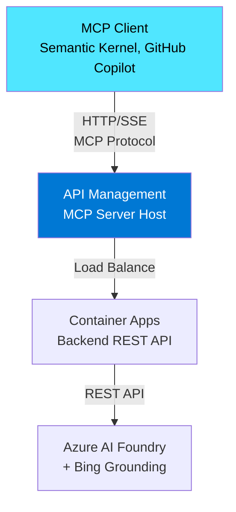

# APIM as MCP Server

## Overview

Azure API Management (APIM) natively supports **exposing REST APIs as Model Context Protocol (MCP) servers**. This eliminates the need to build custom MCP server implementations—APIM automatically converts REST API operations into MCP tools that can be consumed by MCP clients like GitHub Copilot, Semantic Kernel, and other AI agents.

## Architecture



### How It Works

1. **REST API Backend**: Your Container Apps expose REST API endpoints (e.g., `/bing-grounding/{agent_route}`)
2. **APIM Conversion**: APIM automatically converts API operations into MCP tools
3. **MCP Protocol**: APIM exposes an MCP server endpoint using HTTP/SSE transport
4. **Client Connection**: MCP clients connect via `https://<apim>.azure-api.net/<api-name>-mcp/mcp`
5. **Tool Discovery**: Clients can list available tools (converted from API operations)
6. **Tool Execution**: Client calls tools using MCP protocol, APIM routes to backend REST API

## MCP Transport Types

APIM supports the following MCP transport types:

| Transport | Endpoint | Status | Notes |
|-----------|----------|--------|-------|
| **Streamable HTTP** | `/mcp` | ✅ Current | Replaces HTTP + SSE |
| **SSE (Server-Sent Events)** | `/sse`, `/messages` | ⚠️ Deprecated | Protocol version `2024-11-05` |

**Recommended**: Use **Streamable HTTP** (`/mcp` endpoint) for all new implementations.

## Configuration in APIM

### Step 1: Expose REST API as MCP Server

In the Azure Portal:

1. Navigate to your APIM instance
2. Go to **APIs** > **MCP Servers** > **+ Create MCP server**
3. Select **Expose an API as an MCP server**
4. Select your REST API (e.g., "Bing Grounding API")
5. Select API operations to expose as MCP tools
6. Provide MCP server name and description
7. Click **Create**

### Step 2: MCP Server URL

The MCP server URL format:
```
https://<apim-service-name>.azure-api.net/<api-name>-mcp/mcp
```

Example:
```
https://apim-bingground-dev.azure-api.net/bing-grounding-mcp/mcp
```

### Step 3: Authentication

APIM supports multiple authentication methods for MCP servers:

#### Subscription Key (Recommended for Development)
```json
{
  "mcpServers": {
    "bing-grounding": {
      "url": "https://apim-xxx.azure-api.net/bing-grounding-mcp/mcp",
      "headers": {
        "Ocp-Apim-Subscription-Key": "${input:apim-subscription-key}"
      }
    }
  }
}
```

#### JWT (Microsoft Entra ID)
```xml
<inbound>
    <validate-jwt 
        header-name="Authorization" 
        failed-validation-httpcode="401">
        <openid-config url="https://login.microsoftonline.com/{tenant-id}/v2.0/.well-known/openid-configuration" />
        <audiences>
            <audience>api://{client-id}</audience>
        </audiences>
    </validate-jwt>
</inbound>
```

## MCP Client Configuration

### Visual Studio Code

**Option 1: Workspace Settings** (`.vscode/mcp.json`):
```json
{
  "mcpServers": {
    "bing-grounding": {
      "url": "https://apim-bingground-dev.azure-api.net/bing-grounding-mcp/mcp",
      "headers": {
        "Ocp-Apim-Subscription-Key": "${input:apim-subscription-key}"
      }
    }
  },
  "inputs": {
    "apim-subscription-key": {
      "type": "promptString",
      "description": "APIM Subscription Key",
      "password": true
    }
  }
}
```

**Option 2: User Settings** (global):
1. Open Command Palette (`Ctrl+Shift+P`)
2. Run: **MCP: Add Server**
3. Select server type: **HTTP (HTTP or Server Sent Events)**
4. Enter server URL: `https://your-apim.azure-api.net/your-api-mcp/mcp`
5. Choose **user settings** or **workspace settings**

### Semantic Kernel (Python)

```python
from mcp import ClientSession
from mcp.client.sse import sse_client

# Configuration
apim_mcp_url = "https://apim-xxx.azure-api.net/bing-grounding-mcp/mcp"
apim_subscription_key = "your-subscription-key"

# Connect to APIM MCP server
headers = {"Ocp-Apim-Subscription-Key": apim_subscription_key}

async with sse_client(apim_mcp_url, headers=headers) as (read, write):
    async with ClientSession(read, write) as session:
        await session.initialize()
        
        # List available tools
        tools = await session.list_tools()
        for tool in tools.tools:
            print(f"Tool: {tool.name}")
        
        # Call a tool
        result = await session.call_tool(
            "bing_grounding",
            arguments={"query": "latest Azure AI news"}
        )
```

### Azure OpenAI Responses API

```python
from openai import AzureOpenAI

client = AzureOpenAI(
    api_key="your-api-key",
    azure_endpoint="https://your-openai.openai.azure.com/",
    api_version="2025-01-01-preview"
)

response = client.chat.completions.create(
    model="gpt-4o",
    messages=[{"role": "user", "content": "What's the latest Azure news?"}],
    tools=[{
        "type": "mcp_server",
        "server": {
            "url": "https://apim-xxx.azure-api.net/bing-grounding-mcp/mcp",
            "headers": {
                "Ocp-Apim-Subscription-Key": "your-key"
            }
        }
    }]
)
```

## APIM Policies for MCP Servers

### Rate Limiting by MCP Session

```xml
<policies>
    <inbound>
        <!-- Extract request body -->
        <set-variable name="body" value="@(context.Request.Body.As<string>(preserveContent: true))" />
        
        <!-- Rate limit tool calls by MCP session -->
        <choose>
            <when condition="@(
                Newtonsoft.Json.Linq.JObject.Parse((string)context.Variables["body"])["method"] != null 
                && Newtonsoft.Json.Linq.JObject.Parse((string)context.Variables["body"])["method"].ToString() == "tools/call"
            )">
                <rate-limit-by-key 
                    calls="100" 
                    renewal-period="60" 
                    counter-key="@(context.Request.Headers.GetValueOrDefault("Mcp-Session-Id", "unknown"))" />
            </when>
        </choose>
    </inbound>
    
    <backend>
        <base />
    </backend>
    
    <outbound>
        <base />
    </outbound>
    
    <on-error>
        <base />
    </on-error>
</policies>
```

### JWT Validation

```xml
<policies>
    <inbound>
        <validate-jwt 
            header-name="Authorization" 
            failed-validation-httpcode="401"
            failed-validation-error-message="Unauthorized">
            <openid-config url="https://login.microsoftonline.com/{tenant-id}/v2.0/.well-known/openid-configuration" />
            <audiences>
                <audience>api://{your-client-id}</audience>
            </audiences>
        </validate-jwt>
    </inbound>
</policies>
```

### IP Filtering

```xml
<policies>
    <inbound>
        <ip-filter action="allow">
            <address>10.0.0.0/16</address>
            <address-range from="192.168.1.1" to="192.168.1.100" />
        </ip-filter>
    </inbound>
</policies>
```

## Tool Mapping

APIM automatically maps REST API operations to MCP tools:

| REST API Operation | MCP Tool Name | Description |
|-------------------|---------------|-------------|
| `POST /bing-grounding/{agent}?query={query}` | `bing_grounding` | Search with Bing grounding |

### Tool Schema

MCP clients receive tool schemas automatically generated from API operation schemas:

```json
{
  "name": "bing_grounding",
  "description": "Search the web using Bing with AI-powered grounding and citations",
  "inputSchema": {
    "type": "object",
    "properties": {
      "query": {
        "type": "string",
        "description": "Search query"
      }
    },
    "required": ["query"]
  }
}
```

## Benefits of APIM MCP Server

### 1. **No Custom Server Implementation**
- No need to build MCP server from scratch
- APIM automatically converts REST APIs to MCP protocol
- Focus on business logic, not protocol implementation

### 2. **Centralized Governance**
- Apply policies globally across all MCP tools
- Rate limiting, authentication, IP filtering
- Monitoring and logging via Azure Monitor

### 3. **Load Balancing**
- APIM load balances requests across Container App instances
- High availability built-in
- Scale backend independently

### 4. **Security**
- Subscription key management
- JWT validation (Microsoft Entra ID)
- IP filtering and throttling
- TLS 1.2+ enforced

### 5. **Observability**
- Application Insights integration
- Request/response logging
- Performance metrics
- Tool usage analytics

## Limitations

1. **MCP Resources/Prompts**: Currently not supported (only tools)
2. **Workspaces**: MCP servers not supported in APIM workspaces
3. **Protocol Version**: Requires MCP version `2025-06-18` or later
4. **Response Buffering**: Don't access `context.Response.Body` in policies (breaks streaming)

## Troubleshooting

### Issue: 401 Unauthorized

**Cause**: Missing or invalid subscription key

**Solution**:
```python
headers = {"Ocp-Apim-Subscription-Key": "your-valid-key"}
```

### Issue: MCP streaming fails

**Cause**: Response body logging enabled in APIM diagnostics

**Solution**:
1. Go to APIM > **Diagnostic settings**
2. Set **Frontend Response payload bytes** to `0`
3. This prevents response buffering

### Issue: Tool not found

**Cause**: API operation not exposed as MCP tool

**Solution**:
1. APIM > **MCP Servers** > Select server
2. **Tools** blade > Add missing operations

### Issue: Connection timeout

**Cause**: Network/firewall blocking APIM endpoint

**Solution**:
- Verify APIM endpoint is accessible
- Check firewall rules
- Use Azure service tags if needed

## Testing MCP Server

### MCP Inspector (v0.9.0)

```bash
npx @modelcontextprotocol/inspector@0.9.0 \
  --url https://apim-xxx.azure-api.net/bing-grounding-mcp/mcp \
  --header "Ocp-Apim-Subscription-Key: your-key"
```

### curl

```bash
# List tools
curl -X POST https://apim-xxx.azure-api.net/bing-grounding-mcp/mcp \
  -H "Content-Type: application/json" \
  -H "Ocp-Apim-Subscription-Key: your-key" \
  -d '{
    "jsonrpc": "2.0",
    "id": 1,
    "method": "tools/list"
  }'

# Call tool
curl -X POST https://apim-xxx.azure-api.net/bing-grounding-mcp/mcp \
  -H "Content-Type: application/json" \
  -H "Ocp-Apim-Subscription-Key: your-key" \
  -d '{
    "jsonrpc": "2.0",
    "id": 2,
    "method": "tools/call",
    "params": {
      "name": "bing_grounding",
      "arguments": {"query": "Azure AI news"}
    }
  }'
```

## References

- [Expose REST API as MCP Server (Microsoft Learn)](https://learn.microsoft.com/en-us/azure/api-management/export-rest-mcp-server)
- [MCP Server Overview in APIM](https://learn.microsoft.com/en-us/azure/api-management/mcp-server-overview)
- [Model Context Protocol Specification](https://modelcontextprotocol.io/)
- [Use MCP Servers in VS Code](https://code.visualstudio.com/docs/copilot/chat/mcp-servers)
